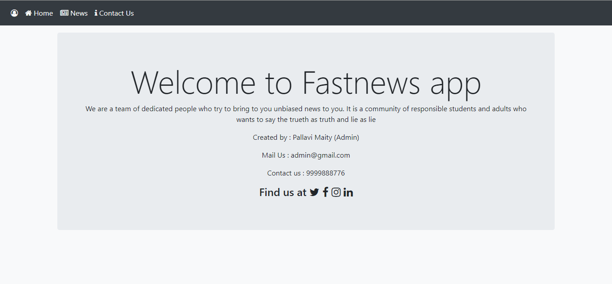

Fast News Web Application

Functionalities:

1) Homepage with Name, Launch date and description of app. Anonymous User can Login or register. Navigation bar has home, news and contact us link.

Any User that is not logged in cannot view news, login required for viewing news.

Home page for normal users, Login button changes to logout

Register page 

Contact page 

2) News page for Normal user. Logged in Users can add news but cannot delete and edit the news.

3) Admin has the rights to add, edit and delete news and also view the registered users.

Admin’s home page 

created using Flask, Bootstrap and Jinja2 

